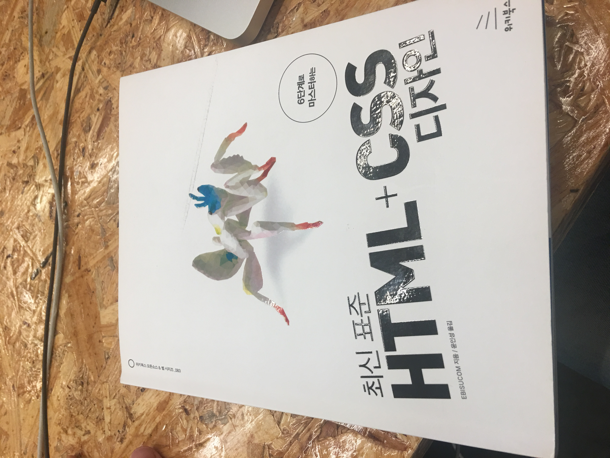

# HTML, CSS Practice with the "HTML + CSS Design"

# This is the end version of this book.

## > The more you enter the programming depth, the more important the HTML and CSS basics are. I wanted to follow the book and build up the foundation steadily.